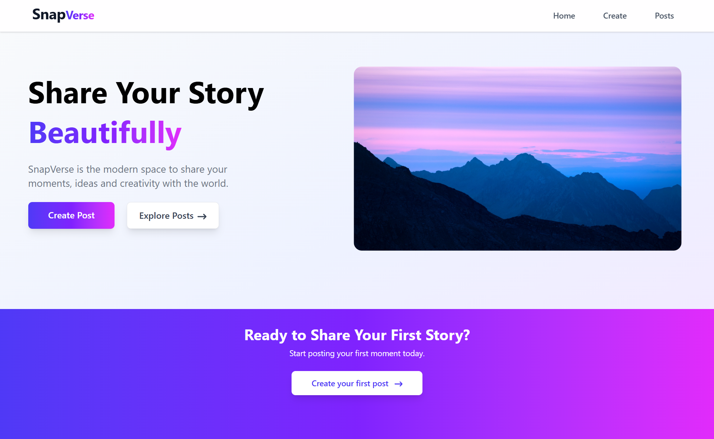
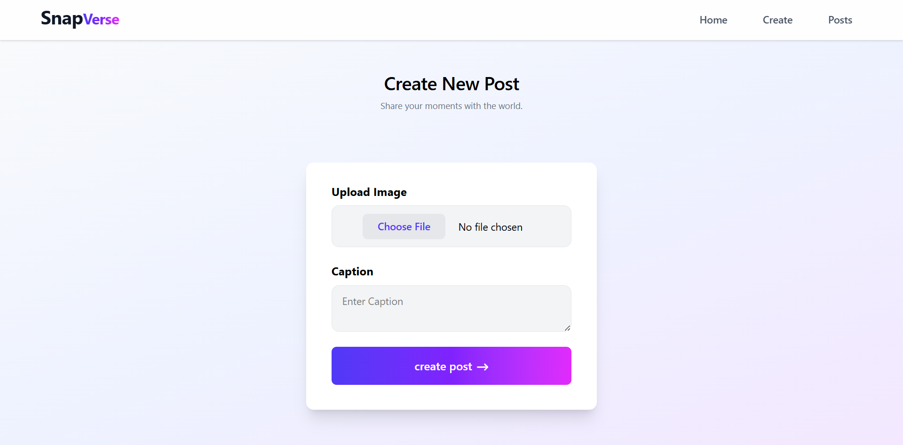

# 📸 SnapVerse

A modern MERN-based social media platform where users can create accounts, upload image posts, and share their moments with others through a clean and responsive interface.

---

## 🚀 Features

- Create New Posts
- Upload Images
- View All Posts
- Responsive Design
- Modern UI
- MongoDB Database
- ImageKit Cloud Image Storage
- REST API using Express.js

---

## 🛠 Tech Stack

### Frontend

- React.js
- Vite
- React Router
- Axios
- Tailwind CSS

### Backend

- Node.js
- Express.js
- MongoDB
- Mongoose
- Multer
- ImageKit

---

## 📸 Screenshots

### Home Page



---

### Create Post



---

### Posts Feed


---

## 📂 Project Structure

```
SnapVerse
│
├── Frontend
│   ├── screenshots
│   │   ├── Home.png
│   │   ├── create.png
│   │   └── posts.png
│   └── ...
│
├── Backend
│   └── ...
│
├── .env.example
├── .gitignore
├── README.md
```

---

## ⚙️ Environment Variables

Create a `.env` file inside the backend folder.

```
MONGODB_URI=your_mongodb_connection_string

IMAGEKIT_PRIVATE_KEY=your_private_key
```

---

## 💻 Installation

### 1. Clone the repository

```bash
git clone https://github.com/Ayesha-Saddique9/SnapVerse
```

### 2. Navigate to the project folder

```bash
cd SnapVerse
```

### 3. Install frontend dependencies

```bash
cd Frontend
```

```bash
npm install
```

### 4. Install backend dependencies

```bash
cd ../Backend
```

```bash
npm install
```

---

## ▶️ Running the Project

### Start Backend

```bash
cd Backend
```

```bash
npm run dev
```

---

### Start Frontend

Open another terminal.

```bash
cd Frontend
```

```bash
npm run dev
```

---

## 📦 API

### Posts

- Create Post
- Get All Posts

---

## 🤝 Contributing

Contributions are welcome!

1. Fork the repository

2. Create a feature branch

```bash
git checkout -b feature-name
```

3. Commit your changes

```bash
git commit -m "Add new feature"
```

4. Push to your branch

```bash
git push origin feature-name
```

5. Open a Pull Request

---

## 👩‍💻 Author

**Ayesha Saddique**

Software Engineer

🔗 GitHub: https://github.com/Ayesha-Saddique9

💼 LinkedIn: https://linkedin.com/in/ayesha-saddique9

📧 Email: ayeshasaddique70@gmail.com

---

## ⭐ Show Your Support

If you like this project, consider giving it a ⭐ on GitHub.
